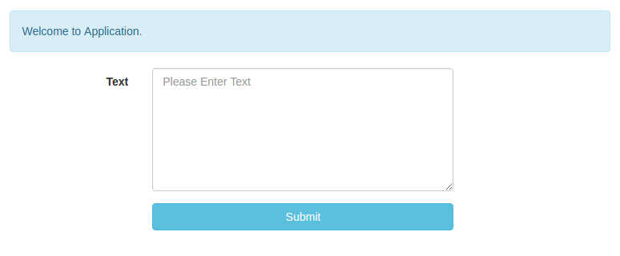
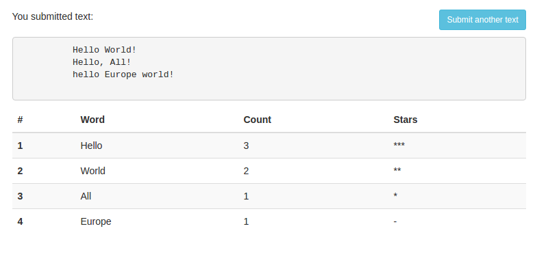

Introduction
You can use any PHP-based backend, JavaScript & CSS framework of your choice.

Database structure
users (id, ip)
words (id, user_id, word, count)

To be implemented
There is a form for entering text (Figure 1), it calculates the number of words in the text and displays the results of the calculations using Ajax (Figure 2). When the “Submit” button is clicked, the user should receive the output as shown in Figure 2.

Conditions
- Case insensitive when comparing words;
- Only words with more than 3 letters should be considered;
- The resulting table is sorted first by word count (DESC) and then by word (ASC);
- Stars are displayed for the first 3 words (for the first - 3, for the second - 2, for the third - 1 star). A dash is displayed for the remaining lines.
- The more modern coding practices used the better (tests, docker, etc.).
- Frontend result shouldn't look exactly the same like on screenshots.

Figure 1 - Start screen

Figure 2 - Text submission result
